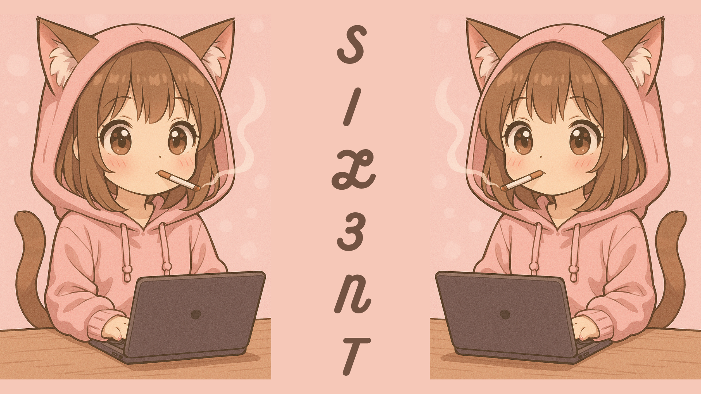

ㅤㅤㅤㅤㅤㅤㅤㅤㅤㅤㅤㅤㅤㅤㅤㅤㅤㅤ

    

---

## 😖 About Me:

    🛡️   Purple Team, Pentester, Security Analyst, and Forensic Analyst
    🌱   Currently learning Golang
    🐻   My goal is to build my own CyberSecurity enterprise
    👨🏻‍💻   All of my projects are available on my GitHub

---

## 💡 Fun Cybersecurity Fact:

🔒 Did you know? The first computer virus ever created was called the "Creeper" virus in 1971, which was more of a playful experiment than a harmful attack. It simply displayed the message: "I’m the creeper, catch me if you can!"

🔒 Did you know? The exploit used by the LockBit ransomware group was a publicly available CVE that allowed them to take over a Windows machine via the RDP protocol. This led to major attacks because people didn't update their systems. So as of today, make sure you update your systems regularly or face the risk of an attack!

---
## Programming in

    
    
    

---

🤣 Cybersecurity Joke:

👾 If girls are made of sugar, spice, and everything nice, and boys are made of slime, snails, and puppy-dog tails, what’s the cloud made from?

    Linux servers, mostly.
---

<h1>❤️ Love Art</h1>
 
   
     
    

        
    

  

---
